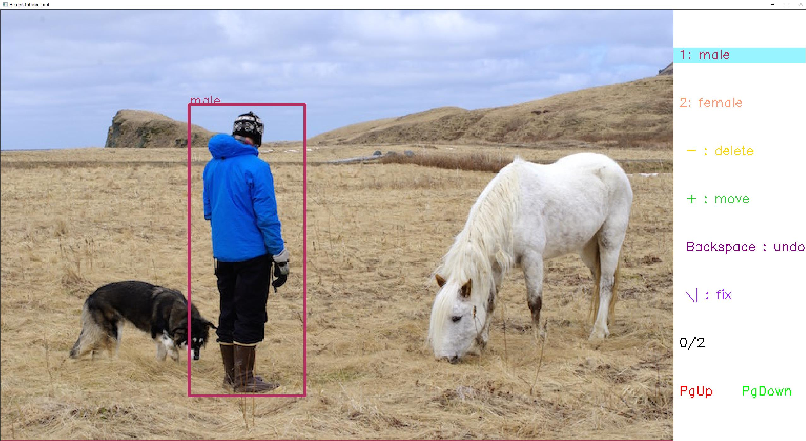

# 目标框标注工具

支持系统：Windows, Linux，Mac系统

标注文件为yolo格式

> ```
> <object-class> <x> <y> <width> <height>
> ```
>
> Where `x`, `y`, `width`, and `height` are relative to the image's width and height

## 安装依赖

```shell
pip install numpy opencv-python -t thirdpartys/lib/site-packages
```

## 运行

提供json格式的配置文件，示例如voc.json

```shell
python labeled_tool.py -c voc.json
```


## 功能

* 目标框标注
* 目标框删除
* 目标框移动
* 目标框标注id修改
* 撤销当前操作
* 类别过滤标注
* 鼠标右键单击切换id
* 鼠标点击进行上下图切换

## 说明

* 按键说明: (字母按键不区分大小写, 输入法需要切换到英文模式)

  * Esc: 退出程序
  * Space: 自动播放与暂停
  * -: 切换到删除模式
  * +: 切换到移动模式
  * Backspace: 切换到撤销模式
  * \\|: 切换到修正模式
  * 1\~9: 切换类别label_id为 0\~8(越界时为最大类别号)
  * 0: 切换类别label_id为9(越界时为最大类别号)
  * W/↑: 向前切换类别
  * S/↓: 向后切换类别
  * A/←: 上一张图片
  * D/→: 下一张图片
  * L: 删除当前图片和标注文件

* 鼠标事件:

  * 标注模式:

    ​    鼠标左键拖动进行目标框标注, 按下与松开分别对应左上点和右下点的位置

    ​    Windows鼠标右键(Linux, Mac左键双击)进行进行目标框类别label_id的切换, 切换离当前鼠标位置最近的框(更新为鼠标点击需要在框内，防止误操作)

  * 删除模式:

    ​	鼠标左键点击, 高亮离当前鼠标位置最近的框 

    ​    Windows鼠标右键(Linux, Mac左键双击)删除目标框, 删除离当前鼠标位置最近的框 

  * 移动模式:

    ​	鼠标左键点击, 高亮离当前鼠标位置最近的框 

    ​    鼠标左键拖动来移动目标框，移动离当前鼠标位置最近的框

  * 撤销模式:

    ​    Windows鼠标右键(Linux, Mac左键双击)撤销操作, 撤销对当前图片的一次操作, 可自定义设置最大撤销记录个数，默认为10

  * 修正模式：

    ​    鼠标左键点击, 高亮离当前鼠标位置最近的框

    ​    按住Alt的同时鼠标左键点击, 高亮所选框最近的顶点(左上点或右下点)

    ​    单击鼠标中键切换高亮的点
    
    ​    在高亮的情况下, Windows鼠标右键(Linux, Mac左键双击), 修正所选点的位置

* 参数文件说明：

  可在对应参数文件(如voc.json)中设置参数

  * windows_name： 标注程序窗口命名

  * dataset_path： 标注数据文件夹路径, 路径下格式为

  ​          \- dataset_path

  ​             \- images

  ​             \- labels  (可选)

  * decay_time: 自动播放等待时间， 单位ms
  * pixel_size： 图像显示最大像素
  * select_type： 选择框模式，默认取离左上点最近框, 取值为1可改为取离中心最近框
  * checkpoint_name: 已标注记录文件, 用来支持多人同时标注
  * total_class_names： 标注所有类别列表
  * class_names： 当前标注只展示的类别列表
  * colors: 标注颜色列表

# 语义分割标注工具

支持系统：Windows, Linux，Mac系统

标注文件为.png格式的mask掩码图像

## 安装依赖

```shell
pip install numpy opencv-python -t thirdpartys/lib/site-packages
```

## 运行

提供json格式的配置文件，示例如voc.json

```shell
python segment_tool.py -c voc.json
```


## 功能

* 掩码标注
* 掩码擦除
* 改变涂抹范围大小
* 撤销当前操作
* 恢复到上一次删除
* 重置掩码
* 区域内重置掩码
* 掩码展示与关闭

## 说明

* 按键说明: (字母按键不区分大小写, 输入法需要切换到英文模式)

  * Esc: 退出程序

  * P: 自动播放与暂停

  * -: 切换到撤销模式

  * +: 切换到恢复模式

  * Space: 切换到擦除模式

  * Backspace: 切换到重置掩码模式

  * 1\~9: 切换类别label_id为 0\~8(越界时为最大类别号)

  * 0: 切换类别label_id为9(越界时为最大类别号)

  * W/↑: 向前切换类别

  * S/↓: 向后切换类别

  * A/←: 上一张图片

  * D/→: 下一张图片

  * L: 删除当前图片和标注文件

  * Q: 缩小描绘点像素大小

  * E: 放大描绘点像素大小

* 鼠标事件:

  * 标注模式:

    ​    鼠标左键拖动进行掩码标注, 按下或按下移动进行涂抹掩码标注

  * 撤销模式:

    ​    Windows鼠标右键(Linux, Mac左键双击)撤销当前操作 

  * 恢复模式:

    ​    Windows鼠标右键(Linux, Mac左键双击)恢复上次撤销操作 

  * 擦除模式:

    ​    鼠标左键拖动进行掩码标注, 按下或按下移动进行涂抹掩码擦除标注

  * 重置模式

    ​    鼠标右键单击(Linux, Mac左键双击)进行掩码的重置, 可通过鼠标左键拖动标注需要重置的区域, 默认重置全图

  * 展示模式:

    ​    Windows鼠标右键(Linux, Mac左键双击)进行掩码映射或取消映射, 按住鼠标左键只显示掩码

# 目标框属性标注工具

支持系统：windows,  Linux，Mac系统

标注文件为yolo格式上添加属性标识

> ```
> <object-class> <x> <y> <width> <height> [<attr_1-class>, ..., <attr_n-class>]
> ```
>
> Where `x`, `y`, `width`, and `height` are relative to the image's width and height

## 安装依赖

```shell
pip install numpy opencv-python -t thirdpartys/lib/site-packages
```

## 运行

提供json格式的配置文件，示例如voc_attr.json

```shell
python attr_labeled_tool.py -c voc_attr.json
```



## 功能

* 目标框标注
* 目标框删除
* 目标框移动
* 目标框标注id修改
* 撤销当前操作
* 类别过滤标注
* 鼠标右键单击切换id
* 属性标注
* 鼠标点击进行上下图切换

## 说明

* 按键说明: (字母按键不区分大小写, 输入法需要切换到英文模式)

  * Esc: 退出程序
  * Space: 自动播放与暂停
  * -: 切换到删除模式
  * +: 切换到移动模式
  * Backspace: 切换到撤销模式
  * \\|: 切换到修正模式
  * 1\~9: 切换类别label_id为 0\~8(越界时为最大类别号)
  * 0: 切换类别label_id为9(越界时为最大类别号)
  * W/↑: 向前切换类别
  * S/↓: 向后切换类别
  * A/←: 上一张图片
  * D/→: 下一张图片
  * L: 删除当前图片和标注文件
  * Q: 切换到上一属性列表
  * E: 切换到下一属性列表

* 鼠标事件:

  * 标注模式:

    ​    鼠标左键拖动进行目标框标注, 按下与松开分别对应左上点和右下点的位置

    ​    Windows鼠标右键(Linux, Mac左键双击)进行进行目标框类别label_id的切换, 切换离当前鼠标位置最近的框(更新为鼠标点击需要在框内，防止误操作)

    ​	可以切换属性后进行目标框和属性的一起标注添加。

  * 删除模式:

    ​	鼠标左键点击, 高亮离当前鼠标位置最近的框 

    ​    Windows鼠标右键(Linux, Mac左键双击)删除目标框, 删除离当前鼠标位置最近的框 

  * 移动模式:

    ​	鼠标左键点击, 高亮离当前鼠标位置最近的框 

    ​    鼠标左键拖动来移动目标框，移动离当前鼠标位置最近的框

  * 撤销模式:

    ​    Windows鼠标右键(Linux, Mac左键双击)撤销操作, 撤销对当前图片的一次操作, 可自定义设置最大撤销记录个数，默认为10

  * 修正模式：

    ​    鼠标左键点击, 高亮离当前鼠标位置最近的框

    ​    按住Alt的同时鼠标左键点击, 高亮所选框最近的顶点(左上点或右下点)

    ​    单击鼠标中键切换高亮的点
    
    ​    在高亮的情况下, Windows鼠标右键(Linux, Mac左键双击), 修正所选点的位置

* 参数文件说明：

  可在对应参数文件(如voc_attr.json)中设置参数

  * windows_name： 标注程序窗口命名

  * dataset_path： 标注数据文件夹路径, 路径下格式为

  ​          \- dataset_path

  ​             \- images

  ​             \- labels  (可选)

  * decay_time: 自动播放等待时间， 单位ms
  
  * pixel_size： 图像显示最大像素
  * select_type： 选择框模式，默认取离左上点最近框, 取值为1可改为取离中心最近框
  * checkpoint_name: 已标注记录文件, 用来支持多人同时标注
  * total_class_names： 标注所有类别列表
  * class_names： 当前标注只展示的类别列表
  * colors: 标注颜色列表
  * attrs： 标注所有属性列表

> 注： 属性框id从1开始记， 0保留为非目标对象的标识。如对person的gender属性进行标注，gender为male记为1， 而该图中存在其他类别(如dog), 该类别在gender属性位记为0.